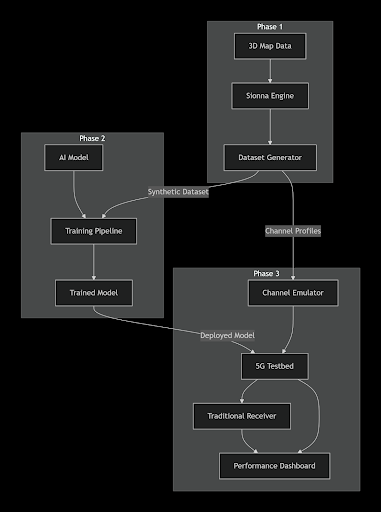
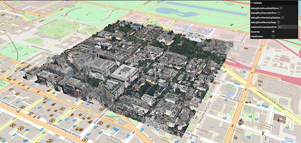

# AI-Native 5G Base Station Receiver Trained with a Digital Twin

Honors Research Project — UT Austin  
Faculty Advisor: Prof. Kaushik Chowdhury  

---

## 📌 Overview
This project studies how an **AI-native 5G receiver** compares to a **traditional signal-processing receiver** when evaluated using a **high-fidelity digital twin** of the UT Austin campus.

Instead of relying on simplified wireless channel models, we use **physics-based ray tracing** to better understand how receivers behave in realistic propagation environments.

---

## 🧠 System Overview

The system is organized as a three-phase pipeline:
1. **Digital twin generation and channel simulation**
2. **AI model training using synthetic channel data**
3. **Deployment and evaluation in a 5G testbed**

This structure allows direct comparison between AI-native and classical receivers under identical channel conditions.

---

## 💡 Motivation (Why)
Wireless systems are often designed and tested under ideal assumptions that do not fully capture real-world effects such as:
- multipath propagation  
- blockage from buildings  
- interference from nearby transmitters  

This project explores whether **machine-learning-based receivers**, when trained on environment-specific channel data, can better adapt to these conditions than traditional signal-processing approaches.

---

## 🛠️ System Design (What)
The system is designed as an end-to-end evaluation framework that includes:
-  A 3D digital twin of the UT Austin campus  
-  Physics-based wireless channel simulation  
-  A traditional 5G receiver baseline  
-  An AI-native receiver architecture  
-  Hardware-in-the-loop validation using a channel emulator  

---

## Digital Twin Environment

Campus geometry is imported from OpenStreetMap and LiDAR-derived data to construct a realistic 3D environment.  
This digital twin is used to generate ray-traced channel profiles that capture building-induced blockage, reflections, and multipath effects.

---

## 🔁 The Process (How)

### Channel Simulation & Data Generation
- Built a ray-tracing-based simulation environment using **NVIDIA Sionna**
- Generated channel impulse and frequency responses across multiple transmitter–receiver locations
- Channel simulations were generated across multiple transmitter–receiver locations and carrier frequencies to capture environment-dependent fading and multipath behavior
- Verified that simulated propagation behavior aligned with expected physical trends

### Traditional Receiver Baseline
- Studied and implemented a classical 5G receiver processing chain
- Analyzed synchronization, channel estimation, equalization, and decoding stages
- Defined evaluation metrics such as **BER**, **BLER**, and **throughput** based on 3GPP standards

### AI-Native Receiver Design
- Designed an ML-based receiver intended to replace selected components of the classical 5G receiver chain (e.g., channel estimation or equalization), trained on digital-twin-generated channel data
- Defined training workflows using digital-twin-generated channel datasets
- Planned integration with **Keysight Propsim** and **OpenAirInterface** for testbed evaluation

---

## 🚦 Current Status
✔ Digital twin creation pipeline validated  
✔ Ray-tracing-based channel simulations verified  
✔ Traditional receiver baseline established  
✔ System architecture and evaluation plan defined  
⏳ AI model training and hardware integration in progress  

This repository documents the **system design, simulation validation, and risk-reduction work** completed so far.

---

## 🧰 Tools & Technologies
- NVIDIA Sionna (ray tracing & channel modeling)  
-  Python  
-  Machine learning frameworks (planned)  
-  OpenAirInterface (5G stack)  
-  Keysight Propsim (channel emulation)  
-  OpenStreetMap & LiDAR data  

---

## 📝 What I Learned
- How to translate wireless theory into a simulation-driven system design  
- How realistic channel modeling changes receiver behavior compared to idealized models  
- The importance of validating system components before full hardware deployment  
- How to fairly compare AI-based receivers with classical signal-processing methods  

---

## 🚀 Next Steps
- Train AI-native receiver models using digital-twin-generated datasets  
- Integrate both receivers into a hardware testbed  
- Compare performance under interference, mobility, and multipath conditions

## Additional Documentation
Detailed notes and design decisions are available below:
- [Digital Twin Modeling](docs/modeling.md)
- [Evaluation Metrics](docs/metrics.md)
- [Signal Processing Background](docs/signal_processing.md)
- [Ray Tracing Experiments](docs/experiments.md)
